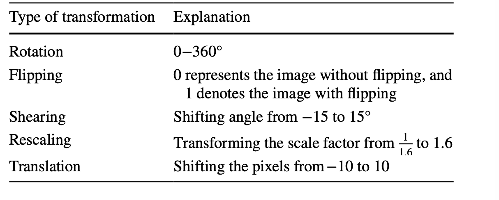
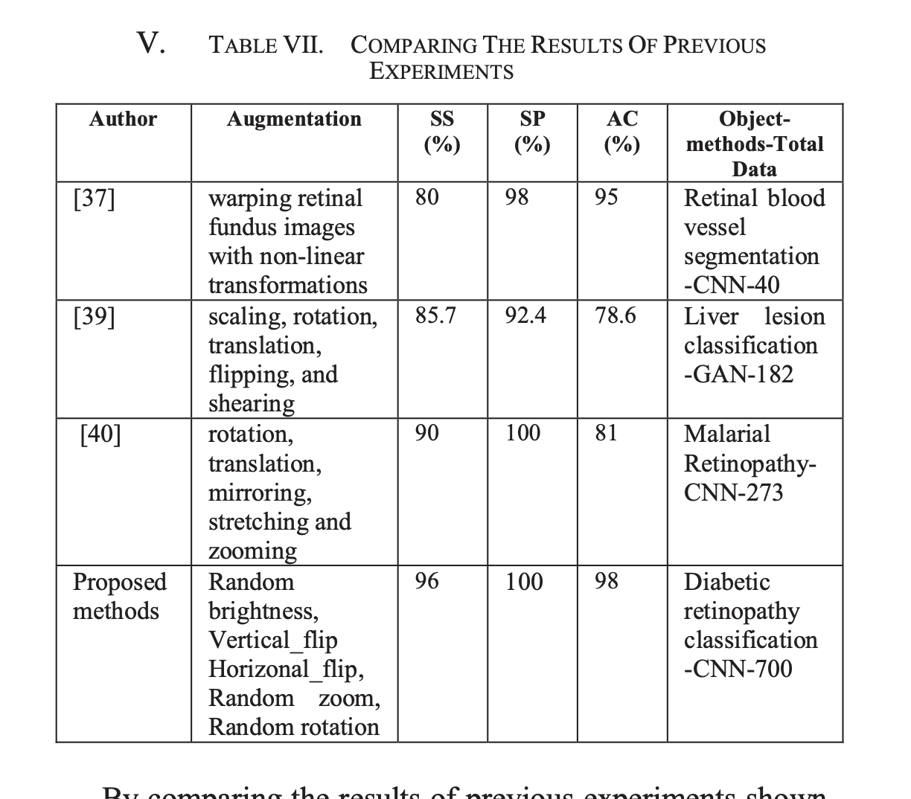
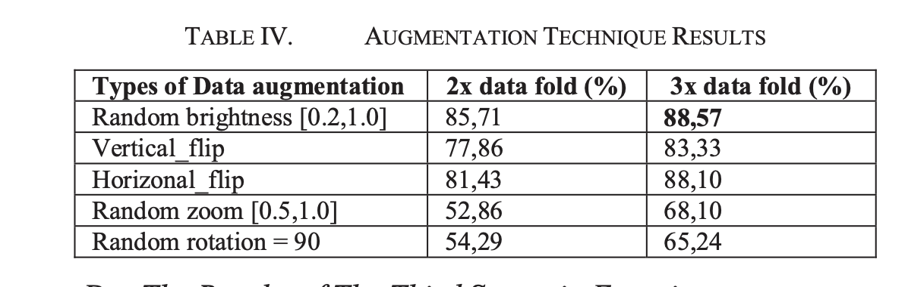

# Articles

## Readed

- AlexNet.pdf
  - Default paper about building CNNs
  - Interesting ideas for augmenting data for testing
    -  At test time, the network makes a prediction by extracting five 224 × 224 patches (the four corner patches and the center patch) as well as their horizontal reflections (hence ten patches in all), and averaging the predictions.
  - Augmenting data for training
    -  The training set was augmented by generating image translations and horizontal reflections [AlexNet.py].

  
- WhenToWarp.pdf
  - Comparing warping in data-space and in feature-space, data-space is better.
  - Methods for data-space used: 
    - affine transformations (translation, shearing, rotation)
    - elastic deformations.

  
- AutoAugment.pdf
  - A new data augmentation technique that uses algorithm based on RL to find the best augmentation policies [AutoAugment.txt].
  - Uses a search space of 16 operations and 10 magnitudes.
  - Operations: 
    - ShearX/Y, TranslateX/Y, Rotate, AutoContrast, Invert, Equalize, So- larize, Posterize, Contrast, Color, Brightness, Sharpness, Cutout [12], Sample Pairing [24].2
  - Dataset: CIFAR-10, SVHN, ImageNet
  - 5 sub-policies, each with 2 operations

  
- Paired_Augmentation_for_Improved_Image_Classification_using_Neural_Network_Models.pdf
  -  Shear, Vertical Flip like single augmentations
  -  Paired augmentations(Simple + Complex) are better than single augmentations
     - Dataset 1 (Brain Tumor dataset):
       - sample pairing (an advanced  technique applied offline) with shear (a simple  technique applied online.
     - Dataset 2 (White Blood Cell dataset):
       - shear (advanced, offline) with vertical flipping (simple, online).
  - Uses augmentation in online and offline manner:
    - Offline augmentation transforms all images by increasing the size of the dataset before input to the model 
    - Online augmentation transforms the images in a batch-wise manner during model training in a feedforward manner.

- Optimizing CNN based model for thyroid nodule.pdf
  - USG images of thyroid nodules
  - Data augmentation: 
    -  RandRotation, RandomXReflection, RandomYReflection, RandomXTranslation, RandomYTranslation
  - Noise remove:
   - Compared median blur and gaussian blur
     - Gaussian blur is better
  - Used morphological operations for segmentation:
    - Erosion, Dilation
  - The morphological gradient function is performed for the enhancement of the edges
  - Good discussed metrics

- An Integration of blockchain and AI.pdf
  - Only noticed ranges for data augmentation
    - |     Syntax      | Description |             Test Text              |
      |:---------------:|:-----------:|:----------------------------------:|
      | rotation_range  |     0.2     |           rotation range           |
      | rotation_scale  |    1/255    |    ratio of image magnification    |
      | horizontal_flip |      1      |  range of horizontal translation   |
      |    fill_mode    |   nearest   |    fill the image when flipping    |
      |   width_shift   |     0.2     |  range of horizontal translation   |
      |   zoom_range    |     0.5     |  ratio of randomly zooming image   |
      |  height_shift   |     0.1     |   range of vertical translation    |
      |   shear_range   |     0.1     | range of projection transformation |

- An_Improvement_for_Medical_Image_Analysis_Using_Data_Enhancement_Techniques_in_Deep_Learning.pdf
  - From text:
    - In this work, for any input image we created other new 3 images using horizontal and vertical flip and rotation by 90 degrees (Figure 1))
  - So they used offline manner of augmentation

- Effectiveness of Data Augmentation in Image Classification.pdf
  - Compared approaches(0.855, 0.890, 0.865, 0.915, 0.900, 0.890, 0.840):
    - None
    - Traditional
      - mage that is shifted, zoomed in/out, rotated, flipped, distorted, or shaded with a hue
    - CycleGAN
    - Neural Net Augmentation + NoLoss
    - Neural Net Augmentation + Content Loss
    - Neural Net Augmentation + Style
    - Control
  

- Automatic-classification-between-COVID19-pneumonia-nonCOVID19-pneumonia-and-the-healthy-on-chest-Xray-image-combination-of-data-augmentation-methodsScientific-Reports.pdf
  - In pipeline of model have (model -> global average pooling layer -> fully connected layer1 -> dropout layer -> fully connected layer2)
  - Without transfer learning easily led to overfitting
  - Propability of dropout 0.1
  - Early stopping with patience 7, 100 epochs
  - Experimenting with layer freezing
  - have code of implementation
  - Was tested with combination augmentations:
    - conventional augmentation
      - (h/v)flipping, (w/h)shifting, rotating, zoom, shear (available at code)
    - mixup (code)
    - Random Image Cropping (code)
    - Patching (RICAP) (code)
  - Best results with conventional + mixup
  - The conventional data augmentation method included ± 15° rotation, ± 15% x-axis shift, ± 15% y-axis shift, horizontal flipping, and 85–115% scaling and shear transformation. The parameters of mixup was set to 0.113.

- BiomedicalImageSegmentation.pdf
  - shift and rotation invariance as well as robustness to deformations and gray value variations.
  - random elastic deformations
    - generate smooth deformations using random displacement vectors on a coarse 3 by 3 grid.
    - displacements are sampled from a Gaussian distribution with 10 pixels stan- dard deviation.
    - Per-pixel displacements are then computed using bicubic inter- polation. 

- Benchmarking CNN on 3D Anatomical Brain MRI:Architectures, Data Augmentation and Deep Ensemble Learning.pdf
  - Need to reread
  - Translation, rotation,random cropping, blurring, flipping and noise addition

- nnU-Net for Brain Tumor Segmentation.pdf 
  - need to reread 
  - From text 
    - increase the probability of applying rotation and scaling from 0.2 to 0.3. 
    - increase the scale range from (0.85, 1.25) to (0.65, 1.6)
    - select a scaling factor for each axis individually
    - use elastic deformation with a probability of 0.3
    - use additive brightness augmentation with a probability of 0.3 
    - increase the aggressiveness of the Gamma augmentation

- A Data Augmentation Method for Fully Automatic Brain Tumor Segmentation.pdf
  - need to reread
  - New method TensorMixUp (modified MixUp) compared with MixUp and CutMix

- Alshazly H, Linse C, Barth E et al (2021) Explainable covid-19 detection using chest ct scans and deep learning. Sensors 21:1–22
  - need to reread, download
  - Gaussian noise addition, cropping, flipping, blurring, brightness changing, shearing, and rotation

- Medical image data augmentation: techniques, comparisons and interpretations
  - good imformation about metrics
  - Commonly applied augmentation methods
    - 2.5.1 Rotation
      - Rotation-based image augmentations are provided by rotating an image by concerning its original position. The rotation uses a new coordinate system and retains the same relative positions of the pixels of an image. It can be rightward or leftward across an axis within the range of [1°, 359°]. Image labels may not always be preserved if the degree of rotation increases. Therefore, the safety of this augmentation technique depends on the rotation degree. Although rotation transformation is not safe on images showing 6 and 9 in digit recognition applications, it is generally safe on medical images.
    - 2.5.2 Flipping
      - Flipping is a technique generating a mirror image from an image. The pixel’s positions are inverted by concerning one of the two axes (for a two-dimensional image). Although it can be applied with vertical or/and horizontal axes, vertical flipping is rarely preferred since the bottom and top regions of an image may not always be interchangeable (Nalepa et al. 2019).
    - 2.5.3 Translation
      - Images are translated along an axis using a translation vector. This technique preserves the relative positions between pixels. Therefore, translated images provide prevention of positional bias (Shorten and Khoshgoftaar 2019) and the models do not focus on properties in a single spatial location (Nalepa et al. 2019).
    - 2.5.4 Scaling
      - Images are scaled along different axes with a scaling factor, which can be different or the same for each axis. Especially, scaling changings can be interpreted as zoom out (when the scaling factor is less than 1) or zoom in (when the scaling factor is greater than 1).
    - 2.5.5 Shearing
      - This transformation slides one edge of an image along the vertical or horizontal axis, creating a parallelogram. A vertical direction shear slides an edge along the vertical axis,
      - while a horizontal direction shear slides an edge along the horizontal axis. The amount of the shear is controlled by a shear angle.
    - 2.5.6 Augmentation using intensities(contrast or brightness, blurring, intensity normalization, histogram equalization, sharpening, and addition of noise)
      - This augmentation is provided by modification of contrast or brightness, blurring, intensity normalization, histogram equalization, sharpening, and addition of noise. If the preferred type of noise is Gaussian, intensity values are modified by sampling a Gaussian distribution randomly. If it is salt-and-pepper type of noise, pixel values are set randomly to white and black. Uniform noise addition is performed by modification of pixel values using randomly sampling a uniform distribution.
    - 2.5.7 Random cropping and random erasing
      - Augmentation by random cropping is applied by taking a small region from an original image and resizing it to match the dimensions of the original image. Therefore, this augmentation can also be called scaling or zooming. Augmentation by random erasing is performed by randomly eliminating image regions.
    - 2.5.8 Color modification
      - Image augmentation by color modification is performed in several ways. For example, an RGB-colored image is stored as arrays, which correspond to 3 color channels representing levels of red, green, and blue intensity values. Because of this, the color of the image can be changed without losing its spatial properties. This operation is called color space shifting, and it is possible to perform the operation in any number of spaces because the original color channels are combined in different ratios in every space. Therefore, a way to augment an RGB-colored image by color modification is to put the pixel values in the color channels of the image into a histogram and then manipulate them using filters to generate new images by changing the color space characteristics. Another way is to take 3 shifts (integer numbers) from 3 RGB filters and add each shift into a channel in the original image. Also, image augmentation can be provided by updating values of hue, saturation, and value components, isolating a channel (such as a blue, red, or green color channel), and converting color spaces into one another to augment images. However, converting a color image to its grayscale version should be performed carefully because this conversion reduces performance by up 3% (Chatfield et al. 2014).
    - 2.5.9 GAN based augmentation
      - GANs are generative architectures constructed with a discriminator to separate synthetic and true images and a generator to generate synthetic realistic images. The main challenging issues of GAN based image augmentations are generating images with high quality (i.e., high-resolution, clear) and maintaining training stability. To overcome those issues, several GAN variants were developed such as conditional, deep convolutional, and cycle GAN. Conditional GAN adds parameters (e.g., class labels) to the input of the generator to control generated images and allows conditional image generation from the generator. Deep convolutional GAN uses deep convolution networks in the GAN structure.
  - 3.2 Implemented augmentation methods (good part about design methods)
  - Good rewiev comparing common single augmentation methods (In results)
  - 6 epoch used for single augmentation methods

- Deep CNN with Hybrid Binary Local Search and Particle Swarm Optimizer for Exudates Classification from Fundus Images .pdf
  - 
  
- Mahmood T, Li J, Pei Y, Akhtar F, Jia Y, Khand ZH (2021) Breast mass detection and classification using deep convolutional neural networks for radiologist diagnosis assistance. In: 45th Annual computers, software, and applications conf (COMPSAC), Madrid, Spain, pp 1918–1923\
  - need to reread, download
  - Rotation, shrinkage, shifting, flipping, cropping, contrast and brightness changing

- Sun X, Fang H, Yang Y et al (2021) Robust retinal vessel segmentation from a data augmentation perspec- tive. In: International workshop on ophthalmic medical image analysis, pp 189–198
  - need to reread, download
  - Channel-wise gamma correction

- Implementation_of_Data_Augmentation_to_Improve_Performance_CNN_Method_for_Detecting_Diabetic_Retinopathy.pdf
  - need to reread
  - best with random zoom and CLAHE(Contrast Limited Adaptive Histogram Equalization)
  - tested vertical flip, horizontal flip, random rotation, random zoom, CLAHE, random brightness
  - 
  - 

- Diagnosis of Diabetic Retinopathy through Retinal Fundus Images and 3D Convolutional Neural Networks with Limited Number of Samples
  - need to read
  - Blurring and shifting
  - and other, reread

- Data augmentation for improving proliferative diabetic retin- opathy detection in eye fundus image 
  - need to read
  - Heuristic augmentation with NV-like structures

## Methods

Here will be summarized good methods for data augmentation:

- Elastic Deformations
- Affine transformations
  - Translation
  - Shearing
  - Rotation

  - Zooming
  - Cropping
  - Erasing
  - Flipping (horizontal, vertical)
  - Color Jittering
  - Cutout

- Channel-wise gamma correction
- shrinkage
- Intensity Augmentation
  - Contrast
  - Brightness
  - Blurring
  - Intensity Normalization
  - Histogram Equalization
  - Sharpening
  - Noise Addition
    - Gaussian
    - Salt-and-pepper
    - Uniform
    - Speckle
    - Poisson
    - Bernoulli
  - Scale ( scaling randomly into different sizes )
  - Gray level augmentation

- Channel-wise gamma correction
- Cutmix
- Mixup (to generate synthetic images)
- TensorMixUp
- Sample Pairing
- Mirroring